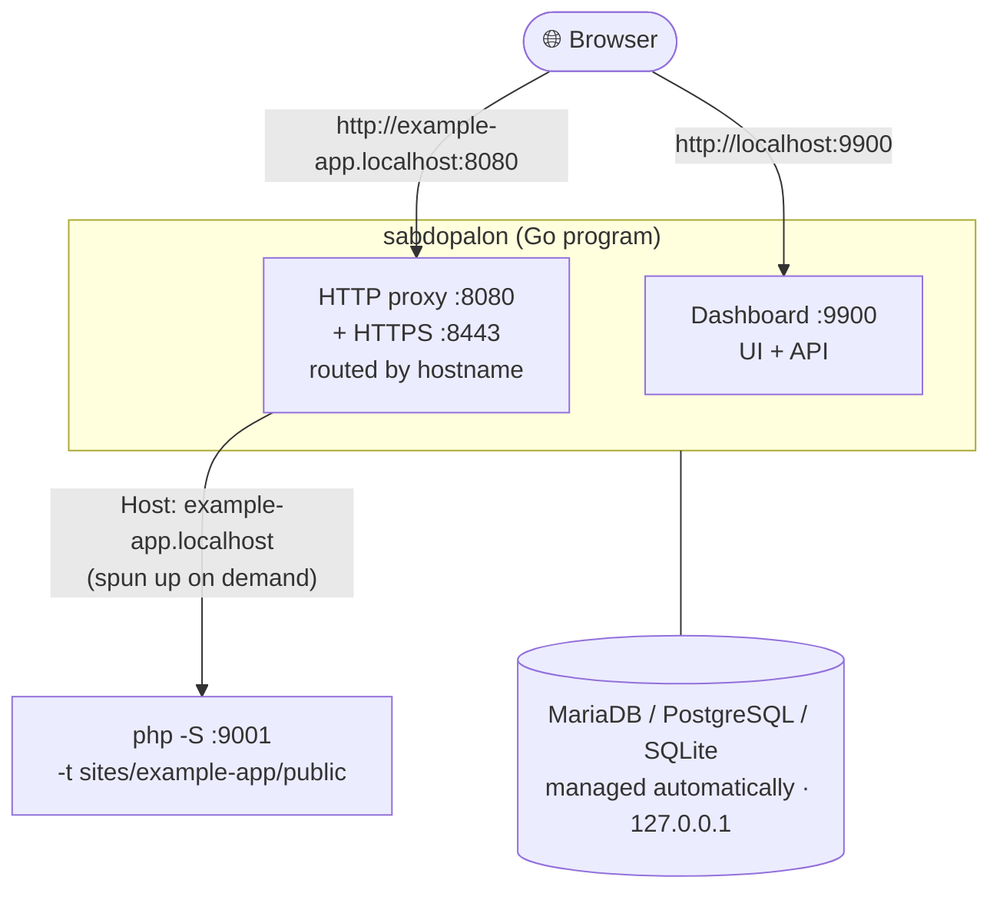

# Contributing to Sabdopalon

This document is for **developers** who want to build Sabdopalon, understand
how it works, or contribute. For the user-facing overview, see the
[README](README.md).

Sabdopalon is a portable, cross-platform local development environment: one
static Go binary that provisions PHP + a database + dev tools into a project
root, serves sites through a built-in reverse proxy on local domains
(`*.localhost` by default), and exposes a React dashboard at `:9900`. An
optional Tauri shell wraps the dashboard as a desktop app.

## Build from source

Requirements: **Go 1.22+**. Building the desktop app additionally needs Node
and a Rust toolchain (see below).

```bash
# 1. Clone
git clone https://github.com/danyakmallun9999/sabdopalon.git
cd sabdopalon

# 2. Build the binary
go build -o sabdopalon ./cmd/sabdopalon      # Linux / macOS
go build -o sabdopalon.exe .\cmd\sabdopalon   # Windows (PowerShell)

# 3. Verify
./sabdopalon version    # Linux / macOS
.\sabdopalon.exe version # Windows

# 4. Run from source (the setup wizard appears on first run)
go run ./cmd/sabdopalon serve
```

### Dashboard (React SPA)

The dashboard is a Vite + React app embedded into the binary via `go:embed`
at build time, so end users don't need Node. Development uses the SPA dev
server and Tauri dev mode.

```bash
cd internal/dashboard/ui
npm ci
npm run dev        # Vite dev server (HMR) against the running Go server
npm run build      # production build (embedded into the Go binary)
npm run typecheck  # tsc --noEmit
npm run lint
```

### Desktop app (Tauri)

The Tauri shell is a convenience wrapper around the web dashboard. The core
Go binary + browser dashboard is the product.

```bash
cd desktop
npm install
bash scripts/build-sidecar.sh   # builds the Go sidecar for your platform
npm run dev                     # tauri dev (needs Rust toolchain)
```

## Fast checks

```bash
gofmt -l .                          # must output nothing
go vet ./... && go build ./...      # fast checks
go test ./...                       # unit tests (race-safe)
cd internal/dashboard/ui && npm ci && npm run build   # SPA build
```

## Repository layout

```
cmd/sabdopalon/        CLI entrypoint (serve, add, ssl, enable-ports, …)
internal/
  app/                 app wiring, CLI handlers (incl. enablePorts elevation)
  config/              engine.toml parsing/writing
  dashboard/           HTTP server + handlers (handlers_*.go)
    ui/                React SPA (Vite) — embedded via go:embed at build
  pkgmgr/              package manager: downloads, extraction, SHA pins,
                       ResolveDefaultPHP (system-vs-bundled preference)
  bootstrap/           layout creation, bundled-core detection, setup marker
  lock/                cross-process single-instance lock (flock/LockFileEx)
  deploy/              phpMyAdmin/site deployment
  proxy/               HTTP/HTTPS proxy; auto-binds :80/:443 when permitted
  ssl/, trust/         local CA, wildcard certs, per-OS trust stores
  terminal/, services/, backup/, profiles/, vhost/, winproc/, devtools/ …
packages/packages.toml optional-package registry (URLs + SHA-256 per OS/arch)
desktop/src-tauri/     Tauri wrapper + sidecar packaging
scripts/install.*      end-user installer scripts
.github/workflows/     ci.yml (every push), release.yml (tag v*)
```

## How it works

Sabdopalon is one Go program that does three jobs:

1. **Reverse proxy.** When a browser requests `myapp.localhost`, the proxy
   finds the matching folder in `sites/` and forwards the request to a
   per-site `php -S` process, routed by hostname. Apache and Nginx are
   unnecessary — PHP's built-in server plus Go's host multiplexing is enough.
2. **Database + services daemon manager.** MariaDB, PostgreSQL, SQLite, and
   optional services (Mailpit, Redis, MinIO, Meilisearch) are started and
   stopped on demand, bound to `127.0.0.1`.
3. **Dashboard.** A React app at `http://localhost:9900` (embedded in the
   binary) controls all of the above over a local API.



### Per-site dev tools (v0.9.0+)

Each site has a dedicated detail page (`/sites/:name`) with tabbed views:
Overview, Config (inline `.sabdopalon.yml` editor), Logs, Dev Tools (start/
stop Vite, Artisan, npm, composer), and an inline Terminal. The
`internal/devtools` supervisor manages per-site tool processes, and the
proxy reverse-proxies Vite HMR paths (`/@vite/`, `/node_modules/.vite/`) to
the running Vite dev server so `name.localhost` serves HMR directly.

## CLI reference

Everything below is also doable from the dashboard — the CLI is optional.

```
sabdopalon [serve]            Start everything; open the web dashboard
                              (flags: --profile <name>, --verbose, --no-open,
                               --setup-mode)
sabdopalon setup              First-run wizard: configure + install the stack
sabdopalon doctor             Health check: PHP, ports, database, SSL
sabdopalon sites              List discovered sites
sabdopalon new <tmpl> <name>  Create a project (templates: blank, laravel,
                              wordpress, codeigniter)

Packages:
sabdopalon add <pkg>          Install a package (mariadb, mailpit, php@8.2 …)
sabdopalon pkg:list           Show available packages
sabdopalon php:list           Show installed PHP versions

SSL / HTTPS:
sabdopalon ssl:ca             Generate the local root CA
sabdopalon ssl:wildcard       Issue *.<tld> wildcard cert for HTTPS
sabdopalon ssl:issue <host>   Issue a certificate for a specific host
sabdopalon ssl:trust          Trust the CA in the OS store (may need sudo)

Database:
sabdopalon backup             Create a database backup now
sabdopalon backup:list        List existing backups

Advanced:
sabdopalon enable-ports       Allow binding :80/:443 for clean URLs
sabdopalon vhost              Print reference Apache vhosts
sabdopalon profile:list | profile:create | profile:delete
sabdopalon version | help
```

## Configuration

### Global config (`config/engine.toml`)

Global settings (TLD, ports, database engine, etc.) live in
`config/engine.toml`, written by the setup wizard and editable from the
Settings page.

### Optional services

Toggle from the Services page in the dashboard (changes apply immediately and
are saved), or set them in `config/engine.toml`:

```toml
[services]
mailpit = false      # local email catcher — SMTP :1025, web UI :8025
redis = false        # cache & queues — :6379
minio = false        # S3-compatible storage — API :9000, console :9001
meilisearch = false  # instant search engine — :7700
```

| Service | Install | Port | What PHP gets |
|---|---|---|---|
| **Mailpit** | `add mailpit` | SMTP 1025 · UI 8025 | `SABDOPALON_MAIL_SMTP`, `SABDOPALON_MAIL_UI` |
| **Redis** | `add redis` (Windows) or system `redis-server` (Linux/macOS) | 6379 | `SABDOPALON_REDIS_HOST`, `SABDOPALON_REDIS_PORT` |
| **MinIO** | `add minio` | API 9000 · Console 9001 | `SABDOPALON_S3_ENDPOINT/KEY/SECRET/BUCKET` |
| **Meilisearch** | `add meilisearch` | 7700 | `SABDOPALON_MEILI_HOST` |

The Services page shows ready-to-paste Laravel `.env` snippets for each
running service (Redis cache/queue, MinIO S3 filesystem, Meilisearch Scout),
complete with copy buttons.

### Database engines

- **SQLite** (default) — zero setup, stored at `data/sabdopalon.db`.
- **MariaDB** — `sabdopalon add mariadb`, then set `engine = "mariadb"` in
  `config/engine.toml`. Starts automatically on `:3306`.
- **PostgreSQL** — `sabdopalon add postgresql` (Linux/macOS; Windows needs a
  system install), then set `engine = "postgresql"`. Runs on `:5432`, user
  `sabdopalon` with local access.

Root credentials follow the usual local conventions (think XAMPP): **root
user with no password**, reachable only from your own machine (`127.0.0.1`),
which plays nicely with phpMyAdmin or the bundled Adminer page (`add adminer`
→ `http://adminer.localhost`).

### Per-site settings (`.sabdopalon.yml`)

Drop this file into a site's folder for per-project overrides:

```yaml
php: "8.3"          # PHP version from `add php@8.3`
php_ini: ""         # override php.ini path
node: ""            # override Node.js version
database: ""        # override DB engine for this site
docroot: public     # site's entry folder (relative to the site folder)
aliases:            # extra domains pointed at this site
  - www.myapp.test
env:
  APP_ENV: local
```

### PHP settings

All PHP processes use `config/php.ini`, generated automatically on first run:

```ini
memory_limit = 256M
upload_max_filesize = 64M
post_max_size = 64M
max_execution_time = 120
date.timezone = UTC
```

Edit that file and restart Sabdopalon (or just the site) to apply.

## Environment variables available in PHP

These are injected automatically into PHP processes for every site:

| Variable | Example |
|---|---|
| `SABDOPALON` | `1` |
| `SABDOPALON_DB_ENGINE` | `sqlite` / `mariadb` / `mysql` / `postgresql` |
| `SABDOPALON_DB_PATH` | `/path/to/sabdopalon.db` (sqlite only) |
| `SABDOPALON_MARIADB_HOST` / `_PORT` / `_USER` / `_PASSWORD` | `127.0.0.1` / `3306` / `root` / … (engine = mariadb) |
| `SABDOPALON_PG_HOST` / `_PORT` / `_USER` / `_DB` | `127.0.0.1` / `5432` / `sabdopalon` / `postgres` (engine = postgresql) |
| `SABDOPALON_VITE_PORT` / `_HOST` | injected when a Vite dev server is running for the site |
| `SABDOPALON_MAIL_SMTP` / `_UI` | Mailpit SMTP + UI (when running) |
| `SABDOPALON_REDIS_HOST` / `_PORT` | Redis (when running) |
| `SABDOPALON_S3_ENDPOINT` / `_KEY` / `_SECRET` / `_BUCKET` | MinIO S3 (when running) |
| `SABDOPALON_MEILI_HOST` | Meilisearch (when running) |

Additional build/runtime environment variables:

| Variable | Purpose |
|---|---|
| `SABDOPALON_DIR` | Override the install root directory |
| `SABDOPALON_BIN_DIR` | Override the bundled-bin directory |
| `SABDOPALON_CORE_ARCHIVE` | Path to a bundled core archive (desktop bundles) |

## Folder structure

```
sabdopalon/
├── sabdopalon                 # the main program
├── config/engine.toml         # global settings
├── config/profiles/           # setting profiles
├── sites/                     # web root: 1 folder = 1 site
├── bin/                       # downloaded packages (PHP, MariaDB, …) — gitignored
├── data/                      # database data folder — gitignored
├── logs/                      # per-site PHP logs + database
├── backups/                   # database backups
└── certs/                     # SSL certificates
```

## Platform support

| | Linux | macOS | Windows |
|---|---|---|---|
| `*.localhost` works out of the box | ✅ automatic | ✅ automatic | ✅ automatic (Win 10+) |
| Need to edit `/etc/hosts` | No | No | No |
| Binary name | `sabdopalon` | `sabdopalon` | `sabdopalon.exe` |

> Modern Linux, macOS, and Windows 10+ all resolve `*.localhost` to
> `127.0.0.1` — no hosts file edits, no admin rights needed.

### Clean URLs (`https://myapp.localhost` — no port)

Sabdopalon tries ports 80/443 first. Without privileges it falls back to
8080/8443 automatically. To allow low ports permanently:

```bash
./sabdopalon enable-ports   # Linux: sudo setcap cap_net_bind_service=+ep <binary>
```

## Git & release workflow

- Branches: `dev` is the integration branch; `main` is release-ready. Merge
  `dev` → `main` with `--ff-only` after `dev` CI is green.
- Commits follow [Conventional Commits](https://www.conventionalcommits.org/)
  with a scope, e.g. `fix(proxy): …`, `feat(setup): …`, `chore(release): …`.
- Releases are cut by pushing an annotated tag `vX.Y.Z` to `main`. The
  `release.yml` workflow builds CLI bundles + desktop installers. The build
  overrides `internal/app.Version` via ldflags from the tag.
- Verify assets with `gh release view vX.Y.Z`.
- Monitor CI with `gh run watch <run-id> --exit-status`.

## Conventions & guardrails

- **Stack artifacts are pinned deliberately.** Download URLs/versions in
  `.github/workflows/release.yml` and `packages/packages.toml` may only
  change after verifying the exact upstream asset exists (`curl -fsI <url>`
  must pass); a wrong guess silently breaks releases on every platform.
- **Never break the cross-compilation matrix.** Every Go change must compile
  and pass tests on linux/darwin/windows (CI enforces this). Use
  `runtime.GOOS` branches rather than build tags unless there is no
  alternative.
- **Trust/elevation UX:** the app must never modify the host system silently.
  Privileged actions (setcap, system CA store) are opt-in, show a single
  explicit prompt, and failure is always non-fatal — the wizard/setup must
  succeed without them.
- **Security defaults:** sites bind `127.0.0.1` unless LAN exposure is
  explicitly requested; do not loosen this.
- **Dashboard UI copy is Indonesian**; keep tone and terminology consistent
  with existing pages.

## Further reading

- **[CHANGELOG.md](CHANGELOG.md)** — what changed in each release.
- **[DESIGN.md](DESIGN.md)** — design rationale and architectural decisions.
- **[docs/](docs/)** — feature design notes.
