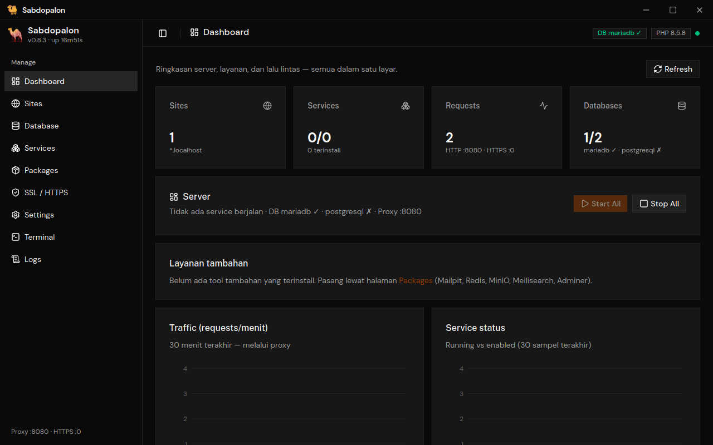
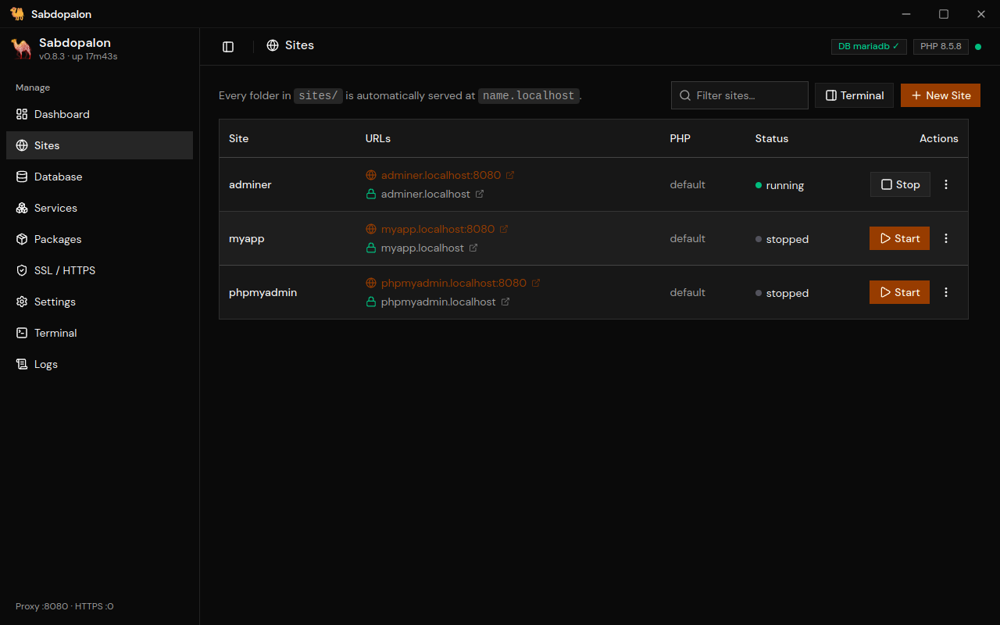
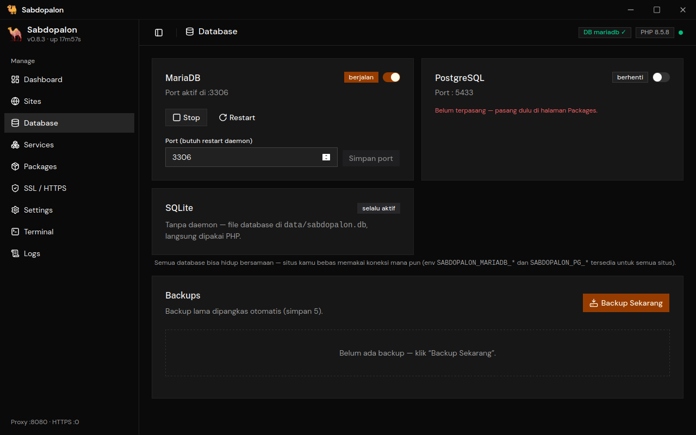
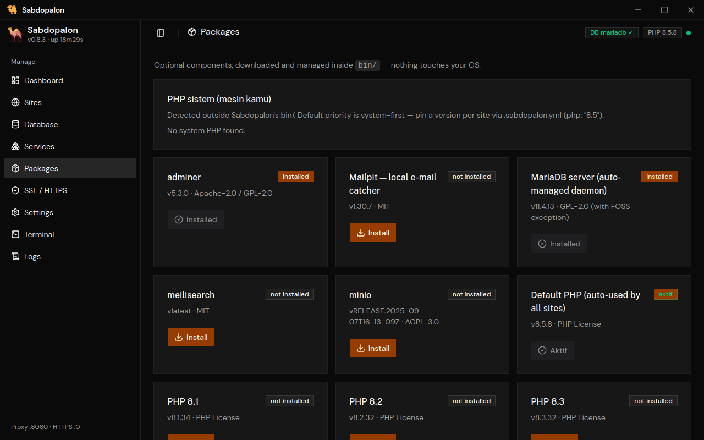
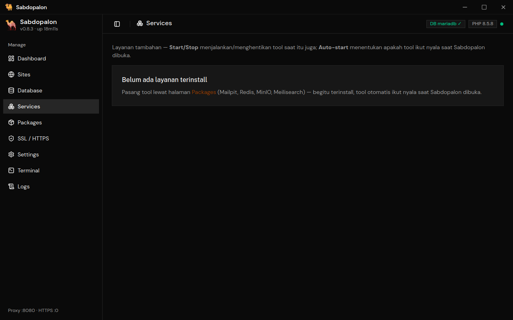
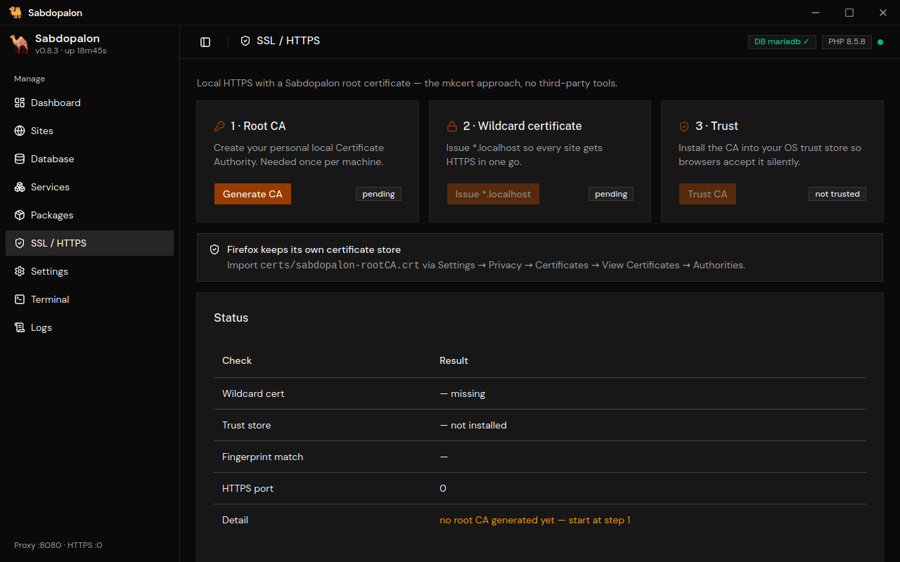
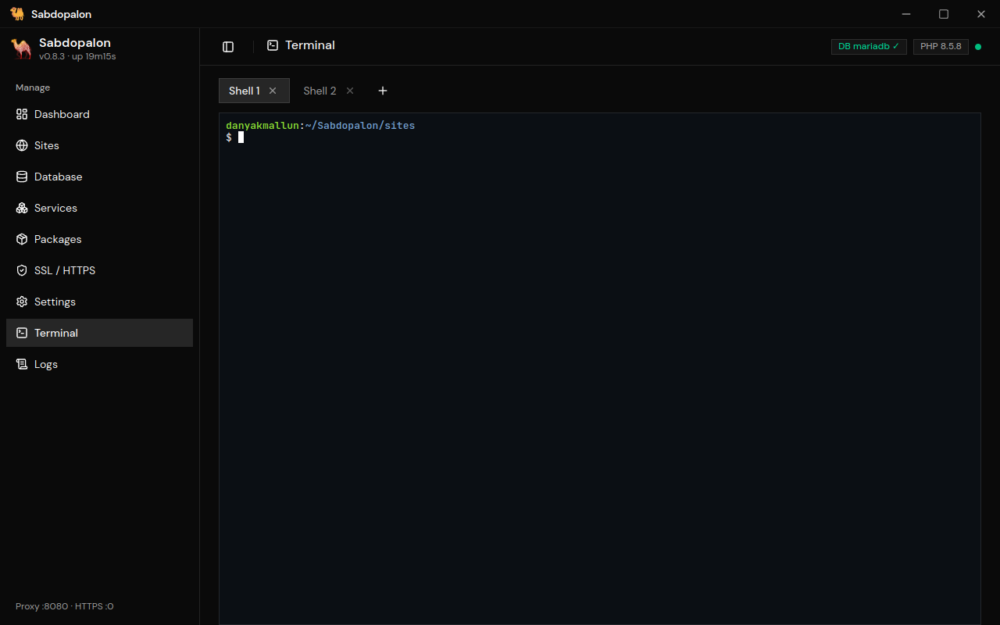
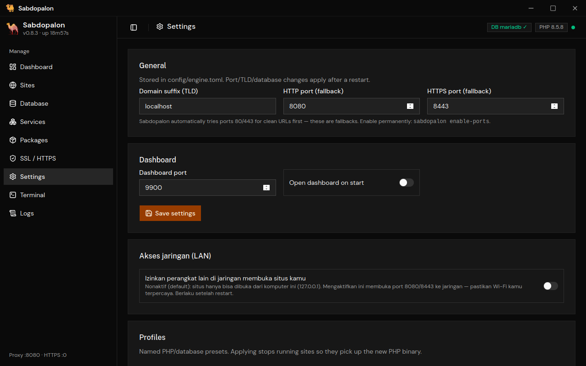
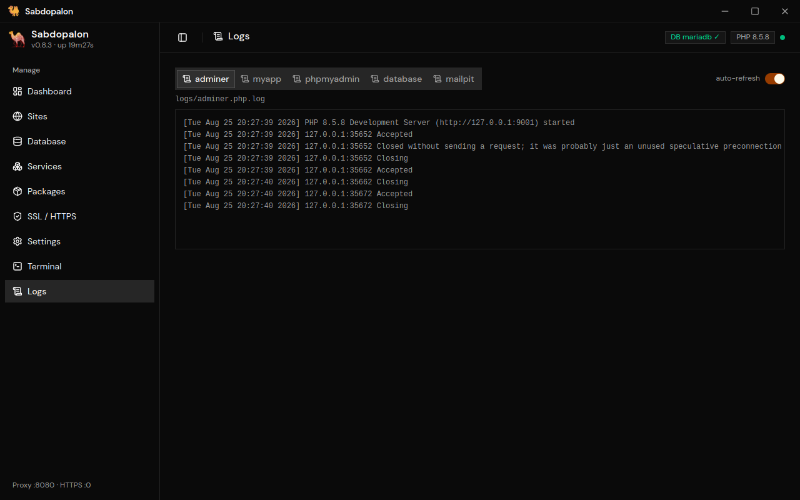
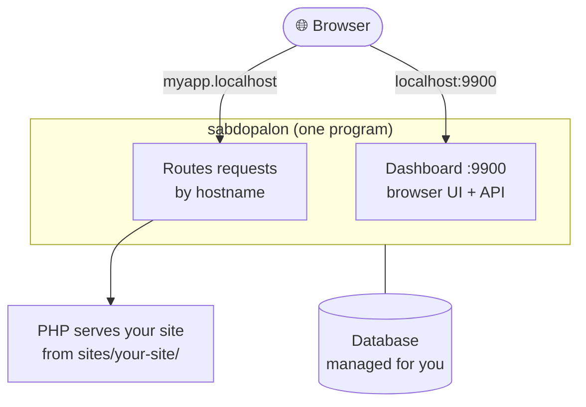

<div align="center">
  
  <p><strong>A ready-to-go local PHP development environment.</strong></p>
  <p>PHP, databases, and dev tools — managed for you, in one folder.</p>
  <p>
    
    
    
    
  </p>
</div>

---

Sabdopalon lets you build PHP websites and apps on your own machine without
the usual setup headache. PHP, a database, and the tools you reach for every
day get installed and managed for you — inside a single folder.

No Apache or Nginx to configure. No manual installs. Nothing touches your
operating system. Just run `sabdopalon` and:

- **Manage it all from your browser** — create sites, start/stop them,
  install PHP or a database, turn on HTTPS, back up your database. Point and
  click, no config files.
- **Sites just work** — drop a folder into `sites/` and it's instantly live at
  `http://yoursite.localhost`. No web server to set up.
- **Safe and clean** — everything lives inside the Sabdopalon folder. Remove
  the folder, remove the app. Your OS stays untouched.

## A peek inside

<p align="center">
  
  <br>
  <em>The dashboard: server status, running services, and traffic — all on one screen.</em>
</p>

<p align="center"><strong>Every page is point-and-click. Here's the rest of it.</strong></p>

<table>
  <tr>
    <td align="center" width="33%"><a href="images/ui/sites.png"></a><br><sub><b>Sites</b><br>Create, start, stop</sub></td>
    <td align="center" width="33%"><a href="images/ui/database.png"></a><br><sub><b>Database</b><br>MariaDB, PostgreSQL, SQLite</sub></td>
    <td align="center" width="33%"><a href="images/ui/packages.png"></a><br><sub><b>Packages</b><br>Install PHP, tools</sub></td>
  </tr>
  <tr>
    <td align="center"><a href="images/ui/services.png"></a><br><sub><b>Services</b><br>Mailpit, Redis, MinIO…</sub></td>
    <td align="center"><a href="images/ui/ssl.png"></a><br><sub><b>SSL / HTTPS</b><br>Local certificates</sub></td>
    <td align="center"><a href="images/ui/terminal.png"></a><br><sub><b>Terminal</b><br>Run composer, artisan</sub></td>
  </tr>
  <tr>
    <td align="center"><a href="images/ui/settings.png"></a><br><sub><b>Settings</b><br>Ports, TLD, profiles</sub></td>
    <td align="center"><a href="images/ui/logs.png"></a><br><sub><b>Logs</b><br>Per-site, database, mail</sub></td>
  </tr>
</table>

## Features

| Feature | What you get |
|---|---|
| **Web dashboard** | Manage everything from the browser — no config editing |
| **Multiple sites** | Every folder in `sites/` automatically becomes a site |
| **Multi-PHP** | PHP 8.1 – 8.5; pick a different version per site |
| **Databases** | SQLite (zero setup), MariaDB, or PostgreSQL — all managed for you |
| **Local HTTPS** | Your own local certificates, in a few clicks |
| **Mail catcher** | Mailpit catches outgoing email locally so nothing leaks |
| **Extra tools** | Redis, MinIO, Meilisearch, Adminer — optional, one click |
| **Backups** | One click, with automatic history |
| **Desktop app** | A native window with a tray icon and a setup wizard |
| **Built-in terminal** | Run `composer`, `artisan`, `php` right from the dashboard |

## Prerequisites

**None.** Sabdopalon is self-contained. You don't need to install PHP, a
database, or Go by hand — the setup wizard handles PHP and the database on
first run. (Go is only needed if you want to build from source.)

> Already have PHP on your machine? Sabdopalon will just use it. Downloads
> only happen when it can't find what it needs.

## Installation

### Option A — Desktop app (no terminal)

Grab the installer from the
[Releases](https://github.com/danyakmallun9999/sabdopalon/releases) page:

| Platform | File |
|---|---|
| Windows | `Sabdopalon_<version>_x64-setup.exe` |
| macOS (Apple Silicon) | `Sabdopalon.app.tar.gz` / `.dmg` |
| Linux | `.deb` / `.AppImage` |

Double-click → a standard setup wizard → done. You never touch a terminal
during install or everyday use. PHP, MariaDB, and phpMyAdmin come bundled in
the installer.

### Option B — One-command installer (terminal)

```bash
# Linux / macOS:
curl -sSL https://github.com/danyakmallun9999/sabdopalon/releases/latest/download/install.sh | bash

# Windows (PowerShell):
irm https://github.com/danyakmallun9999/sabdopalon/releases/latest/download/install.ps1 | iex
```

The installer downloads the binary, adds it to your PATH, then runs the
setup wizard. You answer a few questions (PHP + database by default) and
you're ready.

### Option C — Build from source

See [CONTRIBUTING.md](CONTRIBUTING.md) for building from source, the repo
layout, and how to contribute.

## Quick start

After installing, the **setup wizard starts automatically** on first run.
You can also run it any time:

```bash
sabdopalon              # start everything — dashboard + database + sites
sabdopalon setup        # re-run the setup wizard
sabdopalon doctor       # health check: PHP, ports, database, SSL
```

### Run a site

```bash
# Start Sabdopalon (Ctrl+C to stop)
sabdopalon

# Then open in your browser:
#   http://localhost:9900/              ← dashboard
#   http://example-app.localhost/       ← your site (HTTP)
#   https://example-app.localhost/      ← your site (HTTPS, once set up)
```

### Add a new site

```bash
# From a template:
sabdopalon new laravel myblog
# → open http://myblog.localhost/

# Or just make a folder — it's a site instantly:
mkdir -p sites/myapp/public
echo '<?php echo "Hello!";' > sites/myapp/public/index.php
# → open http://myapp.localhost/ (no restart needed)
```

You can also do all of this from the dashboard — hit **New Site** on the
Sites page.

## How it works (in plain terms)

Sabdopalon is one small program (written in Go) that does three jobs at once:

1. **Serves your sites.** When a browser asks for `myapp.localhost`, it finds
   the matching folder in `sites/` and hands the request to PHP. No Apache or
   Nginx needed — PHP's own built-in server is enough, and the program routes
   requests to it by hostname.
2. **Runs your databases.** MariaDB, PostgreSQL, and SQLite are started and
   stopped for you, bound to `127.0.0.1` so only your machine can reach them.
3. **Gives you a dashboard.** A React app at `http://localhost:9900` lets you
   control all of the above from the browser. It's embedded inside the binary,
   so there's nothing extra to install.



## For developers

The README above is meant for **users**. If you want to build Sabdopalon,
understand its architecture, or contribute:

- **[CONTRIBUTING.md](CONTRIBUTING.md)** — building from source, repo layout,
  commands, environment variables, per-site config, and how to contribute.
- **[CHANGELOG.md](CHANGELOG.md)** — what changed in each release.
- **[DESIGN.md](DESIGN.md)** — the design rationale and architectural
  decisions.

## License

MIT — see [LICENSE](LICENSE). Sabdopalon manages third-party open-source
components (PHP, MariaDB) downloaded through its package system.
