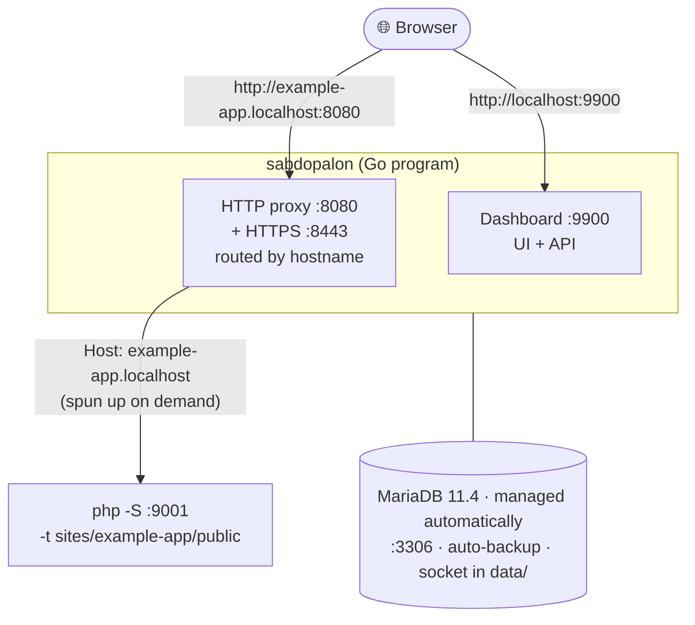

<div align="center">
  
  <p><strong>A ready-to-go local development environment — PHP, databases, and tools in one app.</strong></p>
  <p>Free forever (MIT) · Windows, macOS, Linux</p>
</div>

---

Sabdopalon lets you build PHP websites and apps on your own machine without
the usual setup headache. Everything you need (PHP, database, mail catcher,
and friends) gets installed and managed for you inside a single folder.
No manual installs, no config files to wrestle with.

Just run `sabdopalon` and:

- **Dashboard in your browser** — create new sites, start/stop them, install
  PHP or MariaDB, enable HTTPS, back up your database. All point-and-click.
- **Sites just work** — drop a project folder into `sites/` and it's instantly
  available at `http://yoursite.localhost`. No Apache or Nginx needed.
- **Safe and clean** — everything lives inside the Sabdopalon folder. Your
  operating system stays untouched.

## Main features

| Feature | What it does |
|---|---|
| 🖥️ Web dashboard | Manage everything from the browser — no config editing |
| 🌐 Multiple sites | Every folder in `sites/` automatically becomes a site |
| 🐘 Multi-PHP | PHP 8.1 – 8.5, different versions per site if you want |
| 🗄️ Database | SQLite (zero setup) or MariaDB (managed for you) |
| 🔒 Local HTTPS | Local certificates for your sites in a few clicks |
| 📧 Mailpit | Catch outgoing email locally so nothing leaks out |
| 📦 Extra tools | PostgreSQL, Redis, MinIO, Meilisearch — optional, one click |
| 💾 Database backup | One click, keeps a history automatically |
| 🪟 Desktop app | Native build with tray icon, autostart, and an install wizard |
| ⌨️ Built-in terminal | Run composer/artisan right from the dashboard |

## Status

`v0.7.2` — proper terminal + revamped site pages. The first run kicks off
an interactive setup wizard (in the terminal or in the desktop app) that
prepares everything you need. There's also a one-command installer
(`install.sh` / `install.ps1`), a native desktop app (tray icon +
autostart + GUI wizard), and a built-in terminal in the dashboard.

## Prerequisites

**None.** Sabdopalon is self-contained — you don't need to install Go,
PHP, or MariaDB by hand. Download and run:

- **PHP** — installed automatically by the setup wizard (8.4, ~8MB, 30+ extensions)
- **MariaDB** — installed automatically by the wizard (default choice)
- **PostgreSQL** — optional, one click from the wizard
- **Go** — only needed if you want to build from source yourself

> If your machine already has PHP, Sabdopalon will use it. Downloads only
> happen when PHP can't be found.

## Installation

### Option A: Desktop app (no terminal — recommended on Windows)

Grab the desktop installer from the
[Releases](https://github.com/danyakmallun9999/sabdopalon/releases) page:

| Platform | File |
|---|---|
| Windows x86_64 | `Sabdopalon_0.8.3_x64-setup.exe` (NSIS) |
| macOS (Apple Silicon) | `Sabdopalon.app.tar.gz` / `.dmg` |
| Linux | `.deb` / `.AppImage` |

Double-click → standard GUI setup wizard → done. **You never have to touch
a terminal during installation or everyday use** — first-time setup runs as
a wizard inside the app window, PHP/MariaDB/phpMyAdmin come bundled in the
installer, and no console window pops up while things run in the background.

### Option B: One-command installer (via terminal)

```bash
# Linux / macOS:
curl -sSL https://github.com/danyakmallun9999/sabdopalon/releases/latest/download/install.sh | bash

# Windows (PowerShell) — optional, for terminal folks:
irm https://github.com/danyakmallun9999/sabdopalon/releases/latest/download/install.ps1 | iex
```

The installer downloads the package for your system, extracts it to
`~/sabdopalon` (`%USERPROFILE%\sabdopalon` on Windows), adds it to PATH,
then runs the **setup wizard**. You just answer a few questions
(PHP + MariaDB by default, PostgreSQL optional, ports, sample site).

### Option C: Direct binary download (via terminal)

Download the latest release for your OS from the
[Releases](https://github.com/danyakmallun9999/sabdopalon/releases) page.

| Platform | File |
|---|---|
| Linux x86_64 (Intel/AMD) | `sabdopalon-linux-x86_64.tar.gz` |
| Linux aarch64 (ARM64) | `sabdopalon-linux-aarch64.tar.gz` |
| macOS x86_64 (Intel) | `sabdopalon-macos-x86_64.tar.gz` |
| macOS aarch64 (Apple Silicon) | `sabdopalon-macos-aarch64.tar.gz` |
| Windows x86_64 | `sabdopalon-windows-x86_64.zip` |

Every archive ships the **full package**: binary + default config + package
list + data folder + installer. Extract anywhere and run `./sabdopalon` —
the setup wizard appears automatically on first run.

```bash
# Example (Linux x86_64):
curl -L https://github.com/danyakmallun9999/sabdopalon/releases/latest/download/sabdopalon-linux-x86_64.tar.gz | tar xz
chmod +x sabdopalon
./sabdopalon version

# macOS (Apple Silicon):
curl -L https://github.com/danyakmallun9999/sabdopalon/releases/latest/download/sabdopalon-macos-aarch64.tar.gz | tar xz
chmod +x sabdopalon
./sabdopalon version

# Windows (PowerShell):
# Download sabdopalon-windows-x86_64.zip, extract, then:
.\sabdopalon.exe version
```

### Option D: Build from source (needs Go 1.22+)

```bash
# 1. Clone the repository
git clone https://github.com/danyakmallun9999/sabdopalon.git
cd sabdopalon

# 2. Build the binary
#    Linux / macOS:
go build -o sabdopalon ./cmd/sabdopalon

#    Windows (PowerShell / CMD):
go build -o sabdopalon.exe .\cmd\sabdopalon

# 3. Verify
./sabdopalon version    # Linux/macOS
.\sabdopalon.exe version # Windows
```

### Making it available everywhere (optional)

```bash
# Linux / macOS: symlink into /usr/local/bin
sudo ln -s "$(pwd)/sabdopalon" /usr/local/bin/sabdopalon
# Now 'sabdopalon' works from any folder

# Windows: add the folder to PATH, or copy sabdopalon.exe somewhere on PATH
```

## Quick start

After installing, the **setup wizard starts automatically** on first run.
You can also run it any time:

```bash
./sabdopalon setup        # interactive wizard (PHP + MariaDB by default)
./sabdopalon              # normal start — dashboard + database + sites
./sabdopalon doctor       # health check: PHP, ports, database, SSL
```

## Running a site

```bash
# Start Sabdopalon (Ctrl+C to stop)
./sabdopalon

# Then open in your browser:
#   http://localhost:9900/              ← interactive dashboard
#   http://example-app.localhost:8080/  ← your site (HTTP)
#   https://example-app.localhost:8443/ ← your site (HTTPS, once certs exist)
```

### Adding a new site

```bash
# Way 1: from a template
./sabdopalon new blank myblog
# → creates sites/myblog/public/index.php
# → open http://myblog.localhost:8080/

# Way 2: manually — just make a folder
mkdir -p sites/myapp/public
echo '<?php echo "Hello!";' > sites/myapp/public/index.php
# → open http://myapp.localhost:8080/ (no restart needed)
```

You can also do this from the dashboard: hit **New Site** on the Sites page.

### What gets downloaded automatically

| Component | When | Size |
|---|---|---|
| **PHP 8.4** | First run, if PHP isn't found | ~8 MB |
| **MariaDB 11.4** | Via `sabdopalon add mariadb` or the wizard | ~250 MB |

All files are checksummed (SHA-256) and kept inside the `bin/` folder. No
system-wide installs, nothing polluting your OS, fully portable.

## Extra services (optional)

Local services can be toggled from the **Services** page in the dashboard
(changes apply immediately and are saved), or through the config file:

```toml
[services]
mailpit = false      # local email catcher — SMTP :1025, web UI :8025
redis = false        # cache & queues — :6379
minio = false        # S3-compatible storage — API :9000, console :9001
meilisearch = false  # instant search engine — :7700
```

| Service | Install | Port | What PHP gets |
|---|---|---|---|
| **Mailpit** | `add mailpit` | SMTP 1025 · UI 8025 | `SABDOPALON_MAIL_SMTP`, `SABDOPALON_MAIL_UI` |
| **Redis** | `add redis` (Windows) or system `redis-server` (Linux/macOS) | 6379 | `SABDOPALON_REDIS_HOST`, `SABDOPALON_REDIS_PORT` |
| **MinIO** | `add minio` | API 9000 · Console 9001 | `SABDOPALON_S3_ENDPOINT/KEY/SECRET/BUCKET` |
| **Meilisearch** | `add meilisearch` | 7700 | `SABDOPALON_MEILI_HOST` |

Ready-to-paste Laravel `.env` snippets for each running service show up on
the Services page (Redis cache/queue, MinIO S3 filesystem, Meilisearch
Scout), complete with copy buttons.

### Database engines

- **SQLite** (default) — zero setup, stored at `data/sabdopalon.db`.
- **MariaDB** — run `sabdopalon add mariadb`, then set `engine = "mariadb"`
  in `config/engine.toml`. Starts automatically on `:3306`.
- **PostgreSQL** — `sabdopalon add postgresql` (Linux/macOS; Windows needs a
  system install), then set `engine = "postgresql"`. Runs automatically on
  `:5432`, user `sabdopalon` with local access.

Root credentials follow the usual local conventions (think XAMPP): **root
user with no password**, reachable only from your own machine (`127.0.0.1`)
— which plays nicely with phpMyAdmin or the bundled Adminer page
(`add adminer` → `http://adminer.localhost`).

### Platform notes

| | Linux | macOS | Windows |
|---|---|---|---|
| `*.localhost` works out of the box | ✅ automatic | ✅ automatic | ✅ automatic (Win 10+) |
| Need to edit `/etc/hosts` | No | No | No |
| Binary name | `sabdopalon` | `sabdopalon` | `sabdopalon.exe` |

> **`.localhost` works on every platform**: modern Linux, macOS, and
> Windows 10+ all resolve `*.localhost` to `127.0.0.1` — no hosts file
> edits, no admin rights needed.

## How it works



## Commands

Everything below can also be done from the dashboard — the CLI is optional.

| Command | What it does |
|---|---|
| `sabdopalon` (or `serve`) | Starts everything and opens the dashboard |
| `sabdopalon doctor` | Health check: PHP, ports, database, SSL |
| `sabdopalon sites` | List sites + their URLs |
| `sabdopalon new <template> <name>` | Create a project (blank, laravel, wordpress, codeigniter) |
| `sabdopalon add <package>` | Install packages: `mariadb`, `mailpit`, `php@8.2` … |
| `sabdopalon pkg:list` | List available packages + status |
| `sabdopalon php:list` | Installed PHP versions (8.1–8.5) |
| `sabdopalon ssl:ca` / `ssl:wildcard` / `ssl:issue <host>` / `ssl:trust` | Local HTTPS in four steps |
| `sabdopalon enable-ports` | Allow clean URLs on :80/:443 |
| `sabdopalon backup` / `backup:list` | Database backups |
| `sabdopalon profile:create/list/delete` | Environment profiles |
| `sabdopalon setup` | Re-run the setup wizard |
| `sabdopalon version` / `help` | Version info / help |

### Per-site settings (`.sabdopalon.yml`)

Drop this file into a site's folder for per-project tweaks:

```yaml
php: "8.3"          # PHP version from `add php@8.3`
docroot: public     # site's entry folder (relative to the site folder)
aliases:            # extra domains pointed at this site
  - www.myapp.test
env:
  APP_ENV: local
```

## Dashboard

The dashboard is built with React (modern dark theme) and is embedded in
the binary — Node.js isn't needed to use it. It's only reachable from your
own machine (`127.0.0.1`).

| Page | What's there |
|---|---|
| 🌐 Sites | Create sites from templates, open, start/stop/restart, delete |
| 🗄️ Database | Engine status, one-click backup + automatic history |
| 🧩 Services | Toggle Mailpit/Redis/MinIO/Meilisearch, .env snippets |
| 📦 Packages | Install MariaDB, PostgreSQL, Mailpit, PHP 8.1–8.5 with progress |
| 🔒 SSL | CA → wildcard → trust wizard; detects old certificates |
| ⚙️ Settings | TLD, ports, database engine, auto-open; apply profiles |
| 🖥️ Terminal | Built-in terminal (xterm) — run php, mysql, composer |
| 📜 Logs | Per-site PHP logs, database, and Mailpit |

> **First run / desktop app:** while there's no configuration yet, the
> dashboard switches to **setup mode** and shows the wizard at `/setup`
> (also the landing page of the desktop app).

## Desktop app

Sabdopalon ships a native desktop app — a real OS window (no URL bar),
tray icon, autostart at login, and a **GUI-style setup wizard** on first
launch (terminal not required).

**Guaranteed no-console experience on Windows:** the Go sidecar builds as a
GUI app (`-H windowsgui`) and every child process (PHP, MariaDB,
certutil, etc.) runs with the `CREATE_NO_WINDOW` flag, so no black console
windows appear or flicker — Windows users interact through the GUI only.

- **Windows** — NSIS installer (per-user, no admin), Start Menu shortcut.
- **macOS** — `.dmg`, drag to Applications and you're set.
- **Linux** — `.deb` + `.AppImage`.

App data lives in the OS-specific data folder (e.g. `%LOCALAPPDATA%\Sabdopalon`
on Windows, `~/Library/Application Support/Sabdopalon` on macOS,
`~/.local/share/sabdopalon` on Linux) — the app itself installs read-only.

Building from source:

```bash
cd desktop
npm install
bash scripts/build-sidecar.sh   # builds the Go sidecar for your platform
npm run dev                     # tauri dev (needs Rust toolchain)
```

> **Signing note:** unsigned macOS/Windows builds show a warning the first
> time you open them (right-click → open / "More info"). Code signing
> requires a paid developer account — out of scope for now.

### Clean URLs (`https://myapp.localhost` — no port)

Sabdopalon tries ports 80/443 first. Without privileges it falls back to
8080/8443 automatically. To allow low ports permanently:

```bash
./sabdopalon enable-ports   # Linux: sudo setcap cap_net_bind_service=+ep <binary>
```

## PHP settings

All PHP processes (for every site) use `config/php.ini`, generated
automatically on first run:

```ini
memory_limit = 256M
upload_max_filesize = 64M
post_max_size = 64M
max_execution_time = 120
date.timezone = UTC
```

Edit that file and restart Sabdopalon (or just the site) to apply. Site
specific settings live in `.sabdopalon.yml` (PHP version, docroot,
environment variables).

## Environment variables (available in PHP)

| Variable | Example |
|---|---|
| `SABDOPALON` | `1` |
| `SABDOPALON_DB_ENGINE` | `sqlite` / `mariadb` / `mysql` / `postgresql` |
| `SABDOPALON_DB_PATH` | `/path/to/sabdopalon.db` (sqlite only) |
| `SABDOPALON_PG_HOST` / `PORT` / `USER` / `DB` | `127.0.0.1` / `5432` / `sabdopalon` / `postgres` (engine = postgresql) |
| `SABDOPALON_MAIL_SMTP` / `SABDOPALON_MAIL_UI` | Mailpit SMTP + UI (when running) |
| `SABDOPALON_REDIS_HOST` / `SABDOPALON_REDIS_PORT` | Redis (when running) |
| `SABDOPALON_S3_ENDPOINT` / `KEY` / `SECRET` / `BUCKET` | MinIO S3 (when running) |
| `SABDOPALON_MEILI_HOST` | Meilisearch (when running) |

## Folder structure

```
sabdopalon/
├── sabdopalon                 # the main program
├── config/engine.toml         # global settings
├── config/profiles/           # setting profiles
├── sites/                     # web root: 1 folder = 1 site
├── bin/mariadb/               # downloaded MariaDB (gitignored)
├── data/                      # database data folder (gitignored)
├── logs/                      # per-site PHP logs + database
├── backups/                   # database backups
└── certs/                     # SSL certificates
```

## License

MIT — see [LICENSE](LICENSE). Sabdopalon manages third-party open-source
components (PHP, MariaDB) downloaded via its package system.
